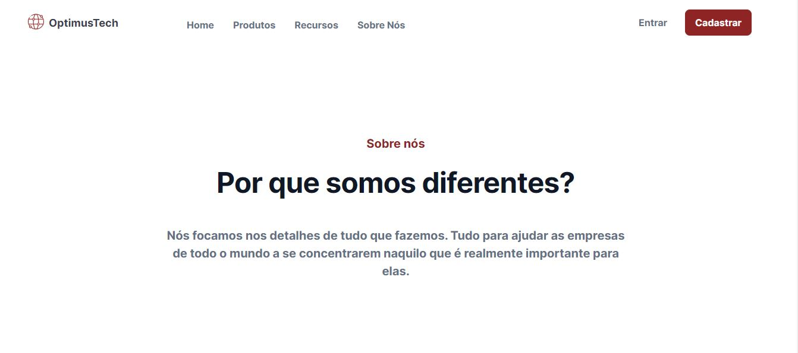
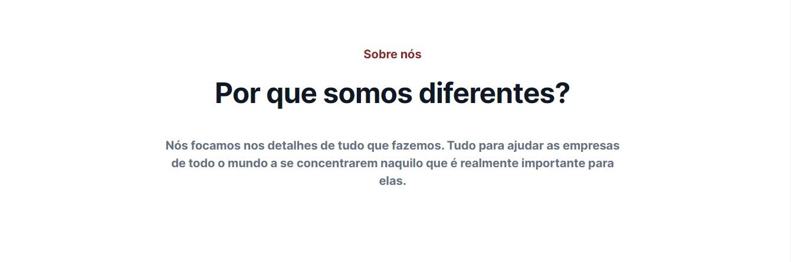
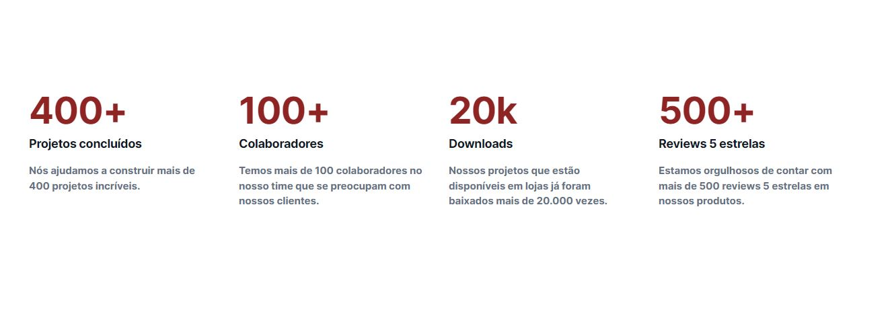
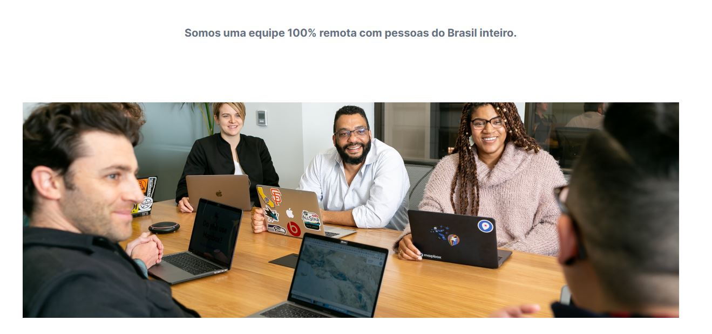
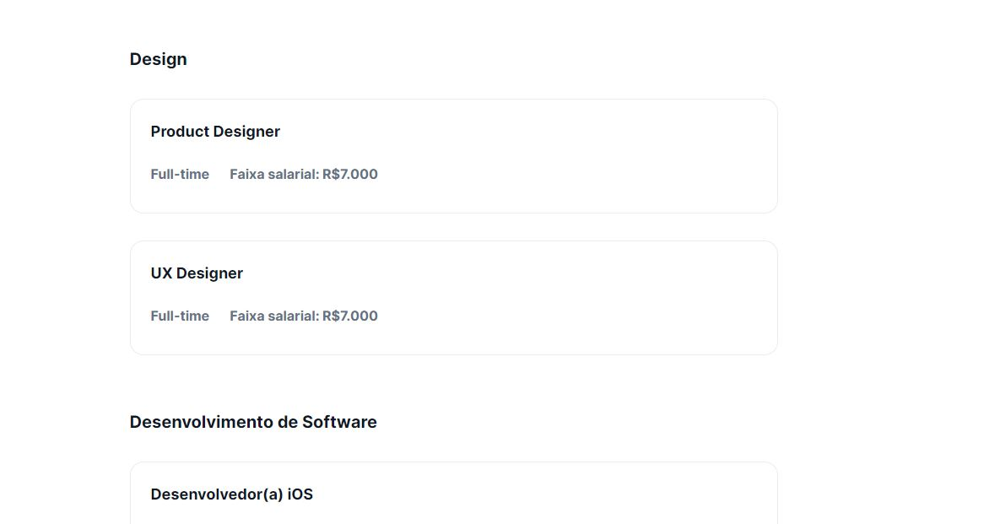
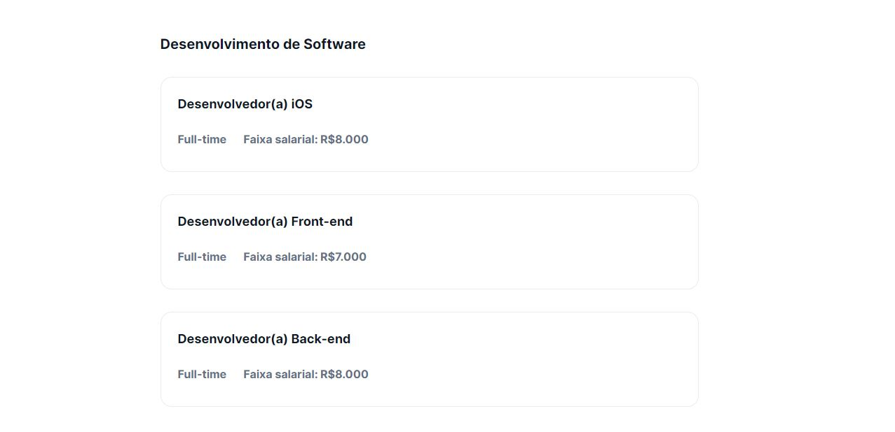
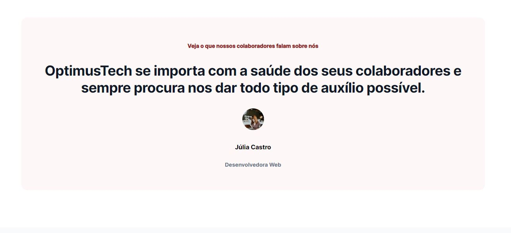
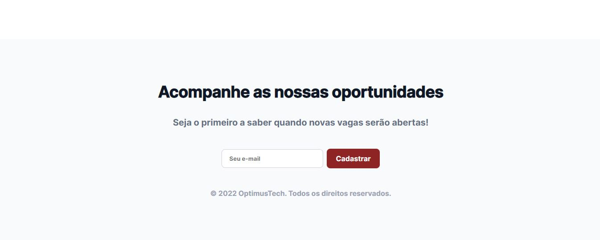

# 7 days of code 

<h2>Desafio Front-end '7 Days of Code' - Objetivo: Criar uma página de 'Vagas' para uma empresa fictícia</h2>

# Resultados

Veja as capturas de tela do projeto finalizado:

  
Cabeçalho

  
  
Seção "Quem Somos"

  
  
Seção Métricas

  
  
Seção com Banner

  
  
  
Seção de Vagas Abertas

  
  
  
Seção Depoimentos

  
  
Footer

  

# Processo
<h3>No 7 days of code, durante uma semana se desenvolve um projeto, parte a parte a cada dia de modo que, no sétimo, o projeto é finalizado</h3>

Clique nos links abaixo para ser enviado à captura de tela correspondete ao dia selecionado:

  <ul>
    <li><a href="#dia_1">Dia 1: Cabeçalho</a></li>
    <li><a href="#dia_2">Dia 2: Seção "Quem Somos"</a></li>
    <li><a href="#dia_3">Dia 3: Seção Métricas</a></li>
    <li><a href="#dia_4">Dia 4: Seção com Banner</a></li>
    <li><a href="#dia_5">Dia 5: Seção de Vagas Abertas</a></li>
    <li><a href="#dia_6">Dia 6: Seção Depoimentos</a></li>
    <li><a href="#dia_7">Dia 7: Footer</a></li>
  </ul>

