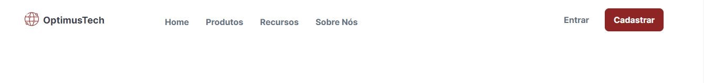

# 7 days of code 

<h2>Desafio Front-end '7 Days of Code' - Objetivo: Criar uma página de 'Vagas' para uma empresa fictícia</h2>

# Resultados

Veja as capturas de tela do projeto finalizado:

  
  
  
  
  
  
  
  

# Processo

No 7 days of code, durante uma semana se desenvolve um projeto, parte a parte a cada dia de modo que, no sétimo, o projeto é finalizado

  <ul>
    <li><a href="#dia_1">Dia 1: Cabeçalho</a></li>
    <li><a href="#dia_2">Dia 2: Seção "Quem Somos"</a></li>
    <li><a href="#dia_3">Dia 3: Seção com Banner</a></li>
    <li><a href="#dia_4">Dia 4: Seção de Vagas</a></li>
    <li><a href="#dia_3">Dia 3: Seção com Banner</a></li>
    <li><a href="#dia_3">Dia 3: Seção com Banner</a></li>
  </ul>

